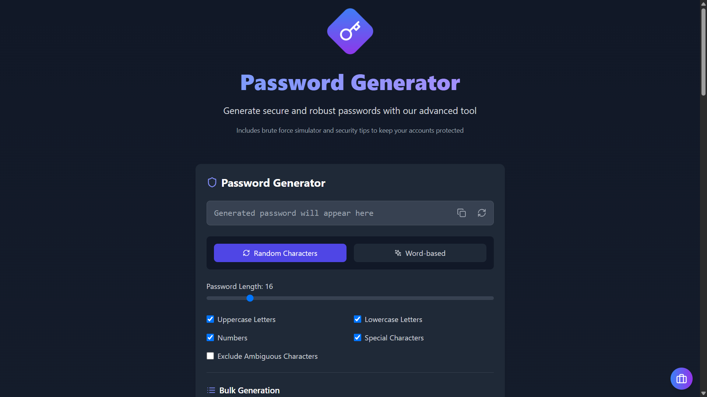

# 🔐 Password Security Toolkit

  

## Table of Contents

- [🎯 Description](#-description)
- [✨ Features](#-features)
- [🛠️ Technologies](#️-technologies)
- [🌐 Deployment](#-deployment)
- [🚀 Installation](#-installation)
- [💻 Usage](#-usage)
- [🔒 Security](#-security)
- [📝 License](#-license)

## 🎯 Description

Password Security Toolkit is a comprehensive web application designed to help you create and manage secure passwords. With a modern and user-friendly interface, this tool allows you to generate strong passwords, evaluate their strength, and better understand security best practices.

## ✨ Features

- **Advanced Password Generator**

  - Random character-based generation
  - Word-based generation (English and Spanish)
  - Complete parameter customization
  - Bulk password generation

- **Security Analysis**

  - Real-time password strength evaluation
  - Brute force attack simulator
  - Cracking time estimates
  - Detailed feedback and suggestions

- **Password Management**

  - Generated password history
  - Customizable tagging system
  - History export and import
  - Favorite marking

- **Security Tips**
  - Detailed best practices guide
  - Practical examples
  - Contextual additional information

## 🛠️ Technologies

- React
- TypeScript
- Tailwind CSS
- Framer Motion
- Lucide Icons
- ZXCVBN (security analysis)

## 🌐 Deployment

You can try the application live at [this link](https://password-generator.onrender.com).

## 🚀 Installation

1. Clone the repository:
   \`\`\`bash
   git clone https://github.com/EduardoProfe666/password-generator.git
   cd password-generator
   \`\`\`

2. Install dependencies:
   \`\`\`bash
   pnpm install
   \`\`\`

3. Start the development server:
   \`\`\`bash
   pnpm dev
   \`\`\`

## 💻 Usage

1. **Password Generation**

   - Select generation mode (random characters or words)
   - Configure parameters according to your needs
   - Generate and copy password with one click

2. **Security Analysis**

   - Watch real-time strength scoring
   - Review cracking time estimates
   - Consider improvement suggestions

3. **History Management**
   - Save important passwords
   - Organize with custom tags
   - Export your history for backup

## 🔒 Security

The application uses:

- Cryptographically secure random number generation
- Advanced password pattern analysis
- Multi-factor security evaluation
- No data storage on external servers

## 📝 License

This project is licensed under the MIT License - see the [LICENSE](LICENSE) file for details.

---

Developed with ❤️ by [EduardoProfe666](https://github.com/EduardoProfe666)
